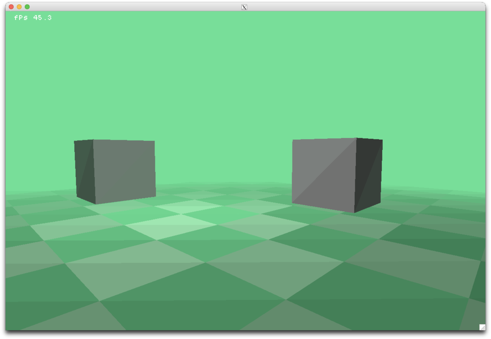

#### Rebuilding my old and ugly Rasterizer, building upon the 2d game engine that i developed:
- repository old: https://github.com/FelixJaschul/rasterizerX11.git (dont look at this its ugly as hell)
- repository 2d : https://github.com/FelixJaschul/gameengineX11.git (take a look pretty neat and minimal)

#### THIS IS IT:

#### TL:DR
you run it with cmake lol. Good luck
- obv only runs on LINUX (my setup (arch btw)) or WSL (tested) and on MACOS (my setup) if XQuartz is installed (because X11 ??)
- the performance has nothing to do with the software but how trash your cpu is bla bla.
- bla bla. Windows wont be supported bla bla.
